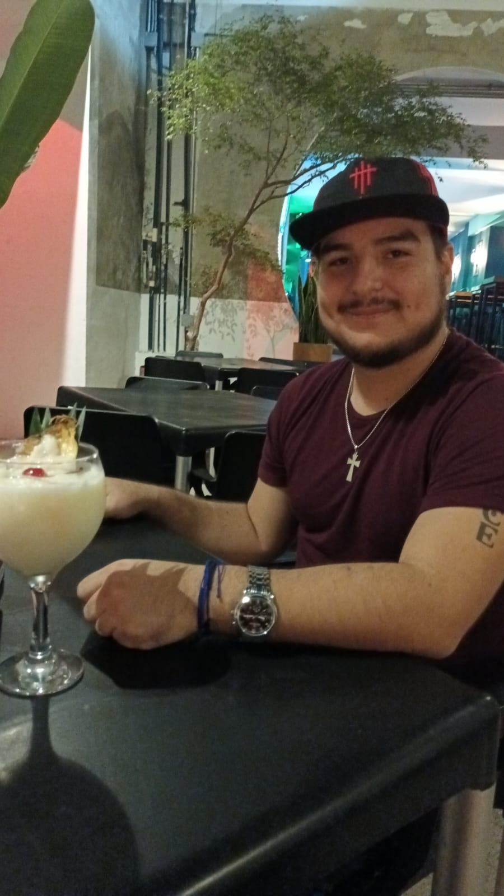

## Hello World 👋 It's [Jesús!](https://jesus-mendoza.pages.dev)

 
I'm a Frontend developer with [React](https://reactjs.org) and [Next](http://nextjs.org)

 

 

 
 
 

## What i'm up to

- 🔭 I’m currently working @ [AI27](https://ai27.com/).
- 🌱 I’m currently working with [React](https://reactjs.org) and [Next](https://nextjs.org).
- 💬 Creating UI Components

 

## Languages and Tools

 

## Coding activity

---
